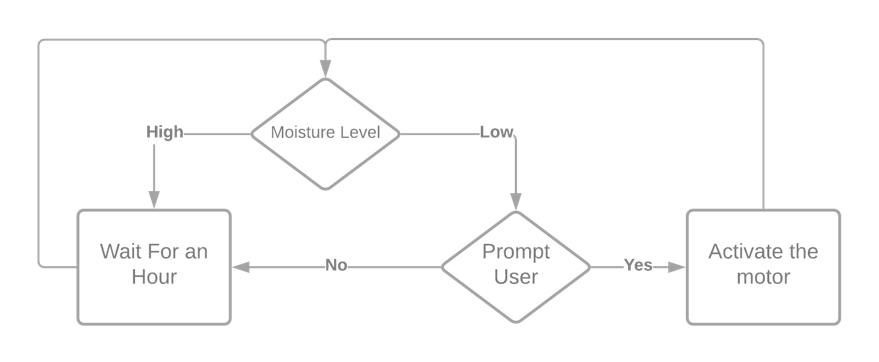
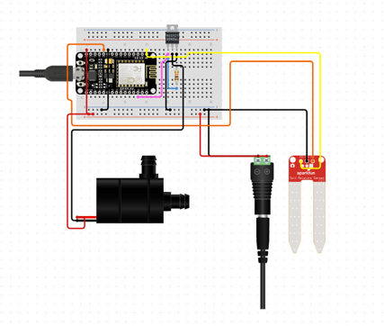
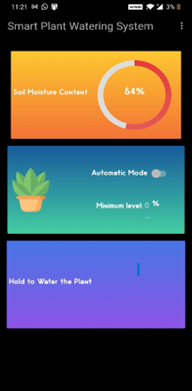

# 🌱 Smart Plant Irrigation System

An IoT-based automatic plant watering system that monitors soil moisture and waters plants as needed. The system includes a mobile app that enables remote monitoring and manual control of watering operations.

## 📱 Overview

This project aims to make plant care hassle-free using smart technology. Built using a NodeMCU microcontroller and soil moisture sensor, the system can:
- Detect real-time soil moisture levels
- Automatically trigger watering when the soil is dry
- Allow manual control via a custom-built Android app
- Operate remotely using Firebase and Wi-Fi connectivity

## 🧠 Features

- 🌡️ Real-time soil moisture monitoring
- 🚿 Automatic and manual watering modes
- 📲 Android app for remote control and monitoring
- ☁️ Cloud-based status syncing using Firebase
- 🔋 Low-power operation for extended use

## 🔧 Components Used

| Component                 | Function                                                                 |
|--------------------------|--------------------------------------------------------------------------|
| **NodeMCU Amica**        | Microcontroller with Wi-Fi connectivity                                  |
| **Soil Moisture Sensor** | Measures soil water content                                              |
| **NPN Transistor**       | Current amplification for motor activation                               |
| **5V Peristaltic Pump**  | Pumps water to soil when triggered                                       |
| **Flyback Diode**        | Protects circuitry from voltage spikes during motor switching            |
| **Breadboard**           | Used for circuit prototyping                                             |
| **Connecting Wires**     | Electrical connections between components                                |

💸 **Estimated Budget for Hardware Components**: ₹1250

## 📲 Android App

- Developed in Java using Android Studio
- Real-time Firebase integration
- Displays moisture levels
- Provides a manual "Water Now" button

## 📈 System Architecture

### 🔌 Block Diagram

### 🔁 Flowchart

### Circuit Diagram

## ⚙️ Technologies Used

- **Android Development** (Java)
- **Arduino C++** (for NodeMCU firmware)
- **Firebase Realtime Database**
- **Git & GitHub**

## 🛠 Setup Instructions

1. Find the Arduino Code File (.ino file) on the releases section.

2. Upload the Arduino code to NodeMCU via Arduino IDE.

3. Wire the components as per the [circuit diagram](circuit_diagram.png).

4. Install the Android app '.apk' from the releases section onto your device.

5. Configure Firebase keys in both Arduino and Android code.

6. Power the system and test via the app.

## 📷 App Screenshot

## 🎥 Working Demo

## 📄 License

This project is licensed under the MIT License. See the [LICENSE](LICENSE) file for more details.
